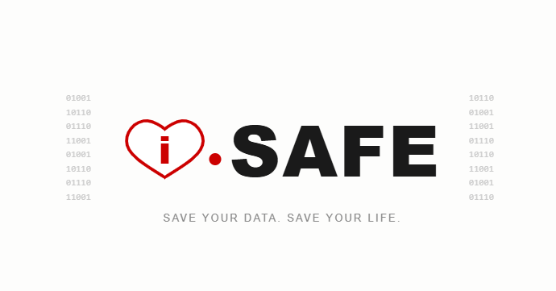

# i-SAFE | Simple Automated File Emergency Backup

*Save your data. Save your life.*

  

## What is i-SAFE?

i-SAFE is a simple one-step backup tool built for everyone.

Not just the tech-savvy. Not just the organised ones.
Everyone.

Because losing your data shouldn't happen to anyone.
And preventing it shouldn't require a computer science degree.

## The problem

Your phone holds everything.
Photos of people you love. Voice notes. Documents.
Memories that exist nowhere else.

And then one day an accident. A fall. A bowl of water.
A moment of bad luck that shouldn't cost you everything.

Most people don't back up because it feels complicated.
i-SAFE exists to remove that excuse. Kindly.

## How it works (v0.1)

- Connect your phone to your computer via USB
- Run i-SAFE
- One step: everything copied to your chosen folder
- Progress shown so you know it's working
- Done. Your data is safe.

No cloud required. No account needed.
Your data goes where YOU decide.

## Features (v0.1)

- One-step backup from phone to computer
- Supports photos, videos, documents, audio, notes
- Progress indicator during backup
- Original filenames preserved
- Copy to external disk supported
- No internet required
- No data sent anywhere. Ever.

## Future features (v0.2)

- Simple GUI. No command line needed
- Scheduled automatic backups
- Backup verification (confirms files copied correctly)
- Multiple device support
- Restore mode. Get your data back easily

## How often should you back up?

i-SAFE recommends:

- **Weekly** for most people
- **Before any trip or important event**
- **Whenever you feel that little anxiety** about losing something

Prevention is always better than recovery.
Back up before disaster. Not after.

## Principles

- One step. No excuses.
- Your data stays yours. Always.
- Free forever. Emergencies don't charge admission.
- Simple enough for everyone. Powerful enough to matter.
- Ethical by design. Private by default.

## Current stage

- concept definition
- initial documentation
- Python prototype in progress

## Next steps

- build basic phone-to-computer file copy in Python
- add progress indicator
- add file type filtering (photos, videos, docs)
- explore automatic scheduling
- build simple GUI (v0.2)

## Vision

A world where nobody loses their irreplaceable memories
because backup felt too complicated.

## Philosophy

Data loss doesn't discriminate.
It happens to the organised and the forgetful.
The tech-savvy and the tech-anxious.
The young and the old.

i-SAFE is built on one belief: protecting what matters to you
should be simple, free and available to everyone.

Not because it's profitable.
Because it's right.

## Free forever

Emergencies don't send invoices.
i-SAFE never will either.

Free for everyone. Always. No exceptions.
This is non-negotiable.

## Personal note

i-SAFE wasn't born from frustration exactly.

It was born from that sinking feeling.
The one you get when a phone drops somewhere it shouldn't.
When you realise how much of your life lives in that small device.
Photos of people who are no longer here.
Voices you recorded just to keep.
Moments you thought were safe.

I know that feeling. Most people do.

i-SAFE exists so that the next time bad luck strikes —
and it will, for all of us. 
The answer isn't panic.
It's: "It's okay. I backed up. i-SAFE."

For everyone who ever lost something irreplaceable.
And for everyone who hasn't yet but will.

*i-SAFE. Save your data. Save your life.*
